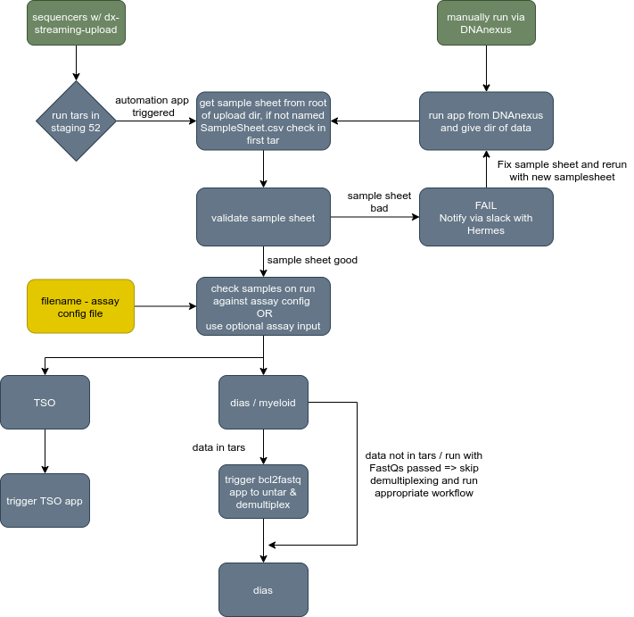
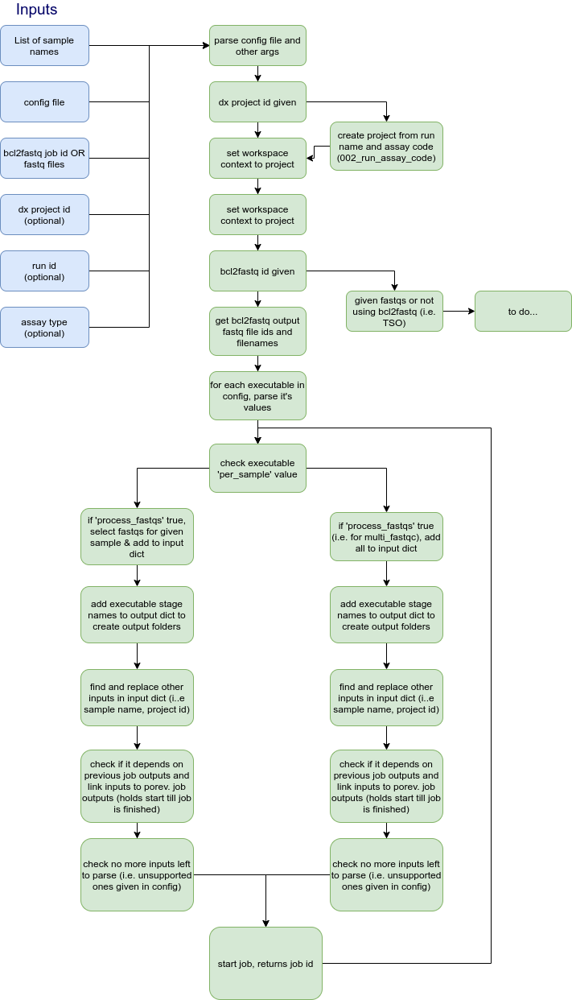

# conductor (DNAnexus Platform App)

DNAnexus app for automating end to end analysis of samples through workflows. 

## What does this app do?

Overview of workflow for example assays:

<p align="center">
    
</p>


Workflow for triggering analysis of each assay for given set of samples:

<p align="center">
    
</p>


## What are typical use cases for this app?
Automating analysis for given samples from a config file definition. This can either be as an app triggered at the end of [dx-streaming-upload](dx-streaming-upload-url) or run as a stand-alone app with the required inputs.


## What data are required for this app to run?

- high level config file - maps sample naming to assay config file to use
- samplesheet (optional) - used to get sample names
- sentinel record file - generated by dx-streaming-upload, used to get sample sheet for run


## Config file design

The app is built to rely on 2 config files, a high level one that maps sample naming to assay config, and an assay specific config file that specifies all aspects of calling the required workflows and applets.

The assay config file for the conductor app is designed to be written as a JSON file, with each workflow or apps defined as an executable. For each workflow/app, there are several required and optional keys to add, with a required structure. An example empty template and populated config file may be found here.

As the config file is a JSON, several fields may be added to enhance readability that will not be parsed when running, such as the name, details and GitHub URL for each executable.

<b>Required keys in the highest level of the config include</b>:

- `demultiplex` (boolean): if to run bcl2fastq to generate fastqs 
- `users` (dict): DNAnexus users to add to output project and access level to be granted
- `executables` (dict): each key should be the workflow or app id, with it's value being a dictionary

Example highest level of config:
```{
    "name": "Config for myeloid assay",
    "version": "v1.0.0",
    "details": "Includes main Uranus workflow, multi-fastqc and uranus annotation workflow",
    "demultiplex": true,
    "users": {
        "org-emee_1": "ADMIN"
    },
```

<b>Required keys per executable dictionary</b>:

- `name`: will be used to name output directory if using output variable naming (see below)
- `analysis`: the value should be written as `analysis_1`, where the number is the executable stage in the config (i.e for the first workflow app this would be `analysis_1`, for the second `analysis_2`...). This is used to link the outputs of one workflow / app to subsequent workflows / apps.
- `per_sample` (boolean): if to run the executable on each sample individually, or as one job
- `process_fastqs` (boolean): if the executable requires fastqs passing
- `inputs` (dict): this forms the input dictionary passed to the call to dx api to trigger the running of the executable, more details may be found [here](dx-run-url). See below for structure and available inputs.
- `output_dirs` (dict): maps the app / workflow stages to directories in which to store output data. See below for structure and available inputs.

<b>Optional keys per executable dictionary</b>:

- `depends_on` (list): Where an executables input(s) are dependent on the output of a previous job(s), these should be defined as a list of strings. This relies on using the `analysis_X` key, where `X` is the number of the executable to collect the output from 
    - (e.g. `"output_dirs": ["analysis_1"]`, where the job is dependent on the first executable)


Example of per executable config:
```
    "executables": {
        "workflow-G4VpkG8433GZKf90KkXB4XZx": {
            "name": "uranus_main_workflow_GRCh38_v1.5.0_novaseq",
            "details": "Main Uranus workflow for alignment and variant calling",
            "url": "https://github.com/eastgenomics/eggd_uranus_main_workflow",
            "analysis": "analysis_1",
            "per_sample": true,
            "process_fastqs": true,
            "inputs": {
                "stage-G0qpXy0433Gv75XbPJ3xj8jV.reads_fastqgzs": "INPUT-R1",
                "stage-G0qpXy0433Gv75XbPJ3xj8jV.reads2_fastqgzs": "INPUT-R2"
            },
            "output_dirs": {
                "stage-G0qpXy0433Gv75XbPJ3xj8jV": "/output/OUT-FOLDER/APP-NAME",
                "stage-G0qpY1Q433GpzBp958KJYfBK": "/output/OUT-FOLDER/APP-NAME",
                "stage-G21GYKj4q5J37F0B5ky018QG": "/output/OUT-FOLDER/APP-NAME",
                "stage-G02ZFz0433GpQB4j9Gvg0b81": "/output/OUT-FOLDER/APP-NAME",
                "stage-G0Y87ZQ433Gy6y7vBB74p30j": "/output/OUT-FOLDER/APP-NAME",
                "stage-G0KbB6Q433GyV6vbJZKVYV96": "/output/OUT-FOLDER/APP-NAME",
                "stage-Fy0549Q41zg02Kjg05x69yvK": "/output/OUT-FOLDER/APP-NAME",
                "stage-Fv6jY9Q4KB7yKfKx8Fq8b7zG": "/output/OUT-FOLDER/APP-NAME",
                "stage-Fy4j4K041zgF5Z8y0x9KjV55": "/output/OUT-FOLDER/APP-NAME",
                "stage-G02ZG6Q433GV76v29b6Gggjp": "/output/OUT-FOLDER/APP-NAME"
            }
        },
```


### Structuring the inputs dictionary

The inputs dict may be given several inputs that act as placeholders to be parsed by the script at runtime. Each key value pair should be given as the app/stage input as the key, and the placeholder as the value. The key MUST match the input given in the specified workflow /apps available inputs (i.e. in `dxapp.json` for apps, `stage-id.input` for workflows). These are all prefixed with `INPUT-` to be identifiable. Currently, these include the following:

- `INPUT-R1`: indicates to pass 1 or more R1 fastq files as input
- `INPUT-R2`: indicates to pass 1 or more R2 fastq files as input
- `INPUT-R1-R2`: indicates to pass all R1 AND R2 fastq files as input
- `INPUT-dx_project_id`: pass the project id used for analysis
- `INPUT-analysis_X-out_dir`: pass the output directory of analysis `X` as input, where `X` is the number of the analysis defined as above

Inputs dependent on the output of a previous job should be defined as shown below. This relies on using the `analysis_X` key, where `X` is the number of the executable to collect the output from.

n.b. where any inputs are linked to previous job outputs, the `depends_on` key should be given in the executable keys, with the value as a list of `analysis_X` to hold for the completion of that job.

- For workflows:

    ```
    "stage-G0QQ8jj433Gxyx2K8xfPyV7B.input_vcf": {
                        "$dnanexus_link": {
                            "analysis": "analysis_1",
                            "stage": "stage-G0Y87ZQ433Gy6y7vBB74p30j",
                            "field": "out"
                        }
                    },
     ```

- For apps / applets:

    ```

    ```


### Structuring the output_dirs dictionary

This defines the output directory structure for the executables outputs. For workflows, each stage should have the `stage-id: /path_to_output/` defined. These may either be hardcoded strings, or optionally use either or both of the following 2 placefolders to subsitute:

- `OUT-FOLDER`: will be named with `/output/` and the `"name"` field for the executable
- 'APP-NAME': will use the name for the given stage / app id from a `dx describe` call

- For workflows:

    ```
    "output_dirs": {
        "stage-G0QQ8jj433Gxyx2K8xfPyV7B": "/output/OUT-FOLDER/APP-NAME",
        "stage-G0QQ8q8433Gb8YFG4q7847Px": "/output/OUT-FOLDER/APP-NAME"
    }
    ```

- For apps / applets:

    ```
    "output_dirs": {
        "applet-Fz93FfQ433Gvf6pKFZYbXZQf": "/output/APP-NAME"
    }

    ```


## Dependencies

[dx-streaming-upload-url]: https://github.com/dnanexus-rnd/dx-streaming-upload
[dx-run-url]: http://autodoc.dnanexus.com/bindings/python/current/dxpy_apps.html?highlight=run#dxpy.bindings.dxapplet.DXExecutable.run